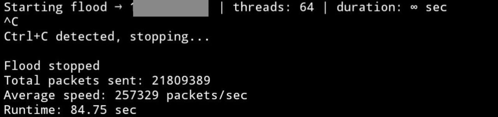

# FloodToolRust
Rust UDP Flood Tool for Network Stress Testing
A lightweight, multi-threaded UDP flooder written in Rust. Built primarily for educational purposes and testing your own home router / local network resilience (you know, to see how fast your cheap TP-Link dies under load 😅).
# Features:
Random source ports by default (great for filling NAT tables)
Customizable threads, duration, and payload size
Built-in random payload generation
Clean Ctrl+C handling
Runs blazing fast even on low-end hardware (tested on phone via Termux — 150k+ pps easy)
Perfect for learning about network protocols, DoS mechanics, or just fucking around with your own gear.

# Important – Read this shit carefully:
This tool is released STRICTLY FOR EDUCATIONAL AND PERSONAL TESTING PURPOSES ONLY.
You are NOT allowed to use it against any network, device, server, or IP address that you do NOT own or have explicit written permission to test.
Using this tool (or any similar tool) without authorization is illegal in most countries (computer fraud/abuse acts, unauthorized access, DoS laws, etc.) and can land you in serious legal trouble.
The author assumes ZERO responsibility for any misuse, damage, downtime, legal consequences, broken friendships, angry parents, police visits, or fried routers caused by this code.
Use at your own risk. Test only your own stuff. Be smart.

## Quick Start – How to Clone & Run

# 1. Clone the repository
git clone https://github.com/NickIBrody/FloodToolRust.git
cd FloodToolRust
# 2. Installing Rust
pkg update
pkg install rust
# 3. launch
cargo run --release -- your.router.IP 0 32 0

# What is my IP address?
ip route show | grep default

# License
 MIT
